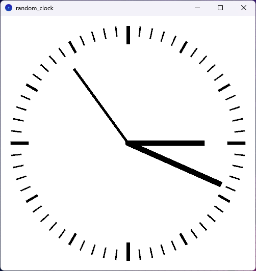
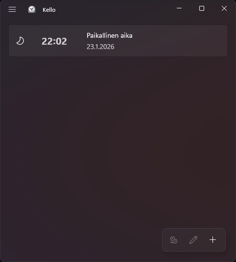
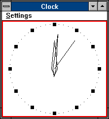

[View the Random Clock in OpenProcessing][openprocessing-random-clock]

Repositories:
[Random Clock][random-clock] (the prototype),
[Godot Clock][godot-clock] (nicer version, in progress)

# Tales of a Clock Maker

<figure class="featured-image">
  
</figure>

I programmed some analog clocks. It might not sound very impressive, but
somehow, it turned out that this was actually a good use of my time!

This is kind of going to be another one of my ungodly long rants about
things that *should* be easy, but which are actually deceptively
complicated. For another one of those, I recommend reading my tiny
short ramble about
[importing photos from SD cards][photoflow-importinator-history].

## Why would anyone make an analog clock, anyway?

In July 17, 2024, I realised that 

1. I was depressed that particular night and 
2. I hadn't written an analog clock before. To heck with it, it had to
   be done.

So I started another one of those projects of mine in which I combat
depression by doing some random interesting coding challenge and post
about it to social media when I'm done.

And I did make it, and I did post it. The original version made in the
dead of the night was untested and had a brainfart, so I fixed it the
next day. The end?

## To make clocks is to court peril

Well, actually, there was a third bit of motivation in making this
clock. 

Long ago, Apple screwed up. Wrath of Switzerland descended upon them,
because [they copied Swiss railway clocks][apple-clock-controversy].
In my depression, I though it was highly tragicomical that Apple
screwed up their clocks. How do you screw up making a clock? That's
*sad.*

But, in 2024, I was noting that *someone else* had screwed up making a clock.

<figure class="featured-image">
  
  <figcaption>(Fig. 1: Windows 11 Clock, version 11.2510.4.0)</figcaption>
</figure>

Remember when Windows had a *good clock?* I hadn't thought of looking at
analog clocks on computers in a while, but I was kind of surprised
that since last time when I remember looking at the analog clock on
Windows...

<figure class="featured-image">
  
  <figcaption>
    (Fig. 2: Windows 3.0 clock. Screenshot courtesy of
    <a href="https://guidebookgallery.org/screenshots/clock">GUIdebook</a>)
  </figcaption>
</figure>

...apparently it turns out Windows 11 clock no longer has an analog
clock mode at all. In fact, you can't even make Windows clock to show
seconds! Android, while not having analog clock either, at least does
show seconds if you ask it really nicely.

Also, at the time, Windows Update and Store were somehow messed up on
my computer and apps got stuck updating for long periods of time. And
Clock needed some updates. Why does a Clock need frequent
updates. Why. If I'm to estimate Microsoft's next move, they'll
probably add Copilot to it next so it can guess the time. (...Eh, I
shouldn't give them ideas.)

## The biggest motivation

So why do I need an analog clock? I had an actual real practical
reason to make an analog clock app of my own.

My weird brain wants an analog clock, with a second hand. Or, an
analog clock plus a digital clock.

I need an analog clock so I can accurately set time manually on my
devices that don't have Internet time sync. Just wait for the second
hand go to the top of the minute and hit the set button. Easy
peasy. Can do that with a digital clock with seconds display, but it's
less clear. Can't mess it up with an analog clock though. *I've been
trained.*

## Internet time sync was almost as big mistake as IoT in general

A prime example of these kind of devices are my cameras. Setting the
clocks manually is a frequent hassle at the daylight saving time
change, and some of these clocks also have a significant amount of
drift so I prefer to set the time every time I charge the batteries.

Well, some of the cameras *theoretically* could sync times through
apps over Bluetooth, but I don't keep Bluetooth on on the cameras
because I prefer the batteries to stay at usable levels for more than
a day. Also, the apps are a bit hassley. (For Nikon, at least.) For
some cameras, the apps are just janky. (People straight up told me not
to use the Ricoh GR III app.) And, well, some apps can go straight to
hell as far as I care. (GoPro replaced the GoPro app with "Quik",
which has some subscription nonsense and, oh, my camera is apparently
obsolete now. How do they consider a camera obsolete? How does that
even *happen,* this alien concept of considering cameras obsolete?
Just asking as a Nikon fangirl... Oh well, at least they didn't take
away the ability to set the time manually.)

So in summary: I made the clocks to serve a very practical need of
having an analog clock around to set the time manually on some of my
devices. And the fact that major OSes didn't have analog clocks was
just *sad.* The closest I had was Android, and even that needed me
constantly prodding my phone's screen to avoid making the phone go
sleep.

## Random Clock (the original prototype)

So, the [old prototype][random-clock] was made in
[Processing][processing] in July 17 to 18, 2024.

In January 23, 2026, I ported it to p5.js, and it's [available for
viewing in browser at OpenProcessing][openprocessing-random-clock].

Topics to cover here in the future:

- Educational bit: mechanics of how the clock works
- Perils of depression coding and releasing stuff in random Mastodon posts

The original Processing version, and its p5.js port, is available
under the MIT License.

## Godot Clock

Currently, I'm writing [a new clock][godot-clock] - that is also a
little bit more useful - in the [Godot Engine][godot-engine].

Windows build is available via Codeberg, other platforms can open and
run the project in Godot Engine.
As of writing, the bleeding edge code is confirmed to work with
Godot 4.5.

Preferably, the tagged releases should be used. I try to not to
push entirely broken versions to the repository too, so chances are
the bleeding edge version in git will also work the same way.

A few niceties are being currently worked on.

Some of the topics I'll cover in the future:

- Mechanics of how the analog clock works this time
- Making seven-segment displays, oh my!
- Theory and practice of implementing [Radio pips][radio-pips]: how
  they work, how to implement them, and how to produce the sounds
  sensibly

GDScript code and Godot scene data released under the MIT
license. Certain data files are Public Domain under CC0.

[apple-clock-controversy]: https://www.cnet.com/tech/tech-industry/time-is-money-apple-pays-21m-for-clock-design-says-report/
[godot-clock]: https://codeberg.org/umbraroze/GodotClock
[godot-engine]: https://godotengine.org/
[openprocessing-random-clock]: https://openprocessing.org/sketch/2855584
[photoflow-importinator-history]: https://umbraroze.github.io/PhotoFlow/photo_importinator/history.html
[processing]: https://processing.org/
[radio-pips]: https://en.wikipedia.org/wiki/Greenwich_Time_Signal
[random-clock]: https://github.com/umbraroze/random_clock
