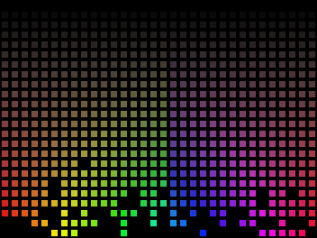

Repository: [Digital flame](https://github.com/umbraroze/digiflame)

<figure class="featured-image">
  
</figure>

This was a random digital flame animation thing. Originally it was
made in [Processing](https://processing.org/) in 2012, and ported to
[p5.js](https://p5js.org/) in 2026.

Inspired by
[some speakers](http://www.youtube.com/watch?v=8asnz3E4n4o).
I can't believe I watched a random Ashens video at 6 AM, couldn't
bloody sleep, so I thought "dammit, I'm going to bash out some
Processing code".  Well, here is it anyway!

This is available under the MIT licence but I don't really care if you
take a looksie and learn from this.

See the p5.js version in action at
[OpenProcessing](https://openprocessing.org/sketch/48878)!
