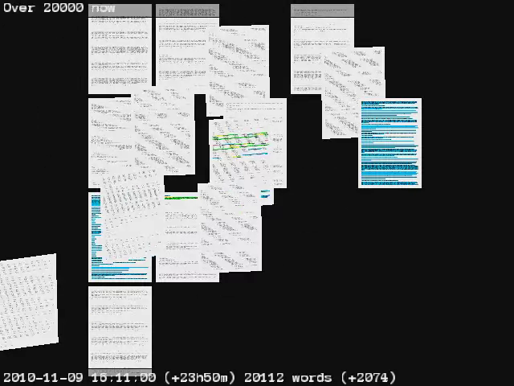
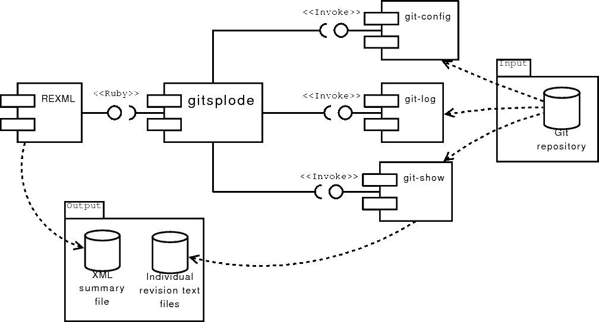
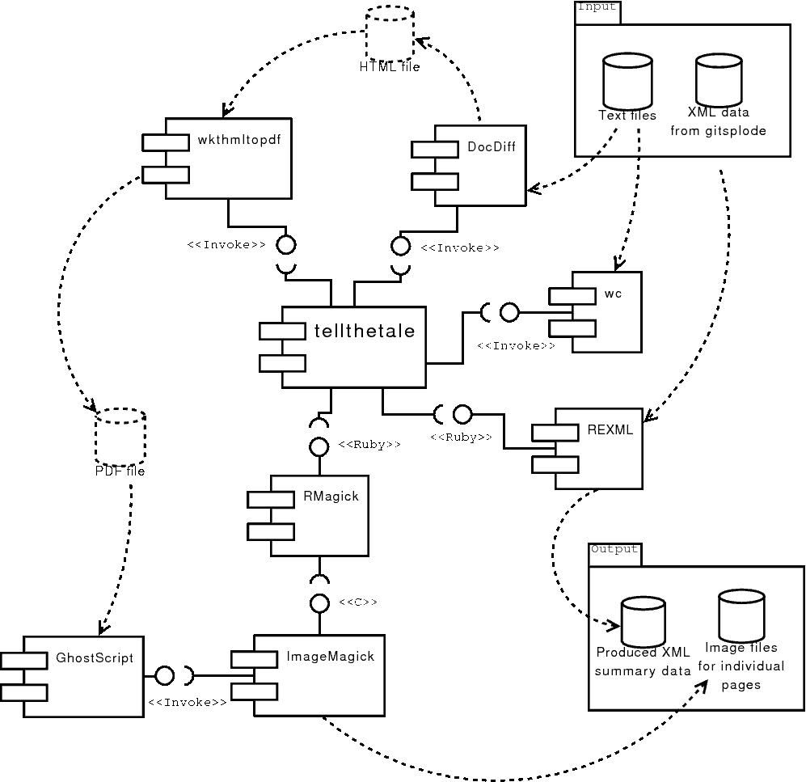
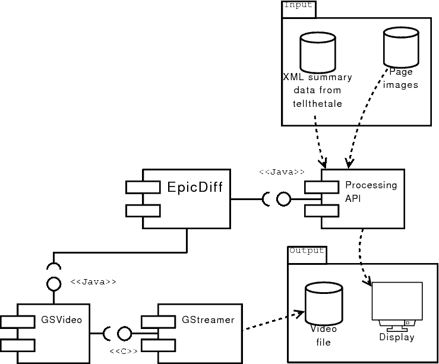

<figure class="featured-image">
  
</figure>

**EpicDiff** is a app suite for creating illustrative and entertaining
animations out of docdiff-produced diffs. It was basically written so
that I can make an animation out of my NaNoWriMo novel, but you can
probably modify it to fit your work flow.

NOTE: THIS SOFTWARE IS PROVIDED IN THE "ITWORKSFORME®"
(or rather "ITSORTAUSEDTOWORKFORME®")
CONFIGURATION. SOME EXPERTISE AND PROVERBIAL TOUCHING OF POTENTIALLY
LIVE WIRES IS REQUIRED. YOU MAY MISS YOUR DEADLINES IF YOU RELY ON
THIS THING, AND I'M NOT TAKING RESPONSIBILITY FOR THAT.
It might blow up when you try to use it. When the smoke clears, please
try to make sense of what went wrong. I regrettably CANNOT guarantee
that I will be able to provide personal assistance on how to use this
program to achieve your goals; you may instead want to go and learn a
bit of Ruby and Processing instead. It's more fun that way! I also
cannot guarantee this hack is _constantly_ developed; I may update it
in future, however, when I actually need it, and in those cases, try
not to strip away any of the functionality that is already present and
will only add new options.

## Links and downloads

(This section is a mess. I need to update the links! And post the
video to YouTube or something.)

- [GitHub repository](https://github.com/umbraroze/epicdiff)
  for the `epicdiff` Processing sketch, as well as
  `tellthetale.rb` and `gitsplode.rb` Ruby scripts.


<!-- TODO: Post the video to YouTube -->
* [A video](http://www.dailymotion.com/video/x3vtkdj_epicdiff-nanowrimo-2010-progress-animated_creation) of my NaNoWriMo 2010 writing process is available on DailyMotion.
<!-- Embedded video? -->


## Dependencies

Conversion tool:

* Probably some sort of POSIX userland. (Needs the wc(1) tool.)
* [Ruby](http://www.ruby-lang.org/) and
  [RMagick](https://rmagick.github.io/) [ gem install rmagick ]
* [DocDiff](https://github.com/hisashim/docdiff/)
* [wkhtmltopdf](https://wkhtmltopdf.org/)

Animation software:

* [Java SE JRE](http://www.java.com/) Last tested with Sun Java 6
  under Debian Linux.
* [Processing](http://processing.org/) This is built in Processing 1.2.1.
* [GSVideo](http://gsvideo.sourceforge.net/) My runs worked with
  GSVideo 0.7 in Debian Linux.

(**MAINTENANCE NOTE:** As stated, these versions are ancient. GSVideo in
particular is *exceedingly* obsolete, as the video facility in
Processing 2 and later is based on it and included by default.)

### Compatibilty notes

The code was written in Ruby 1.8 days and hasn't been really used
since, so there _may_ be some small hitches with 1.9/2.x. I don't
expect anything Earth-shattering, however. It's not like we'd be on
Python or anything. `</obligatoryjab>`

As detailed in the technical discussion below, Processing 1.x only
shipped with obsolete Java QuickTime layer and required the external
GSVideo library for this kind of stuff. Processing 2.x and later
actually includes a new video API that is based on GSVideo, so when I
get around to updating this app to be compatible with modern
Processing versions, it should work without too many changes (class
names are different and that's about that).

## Workflow

The workflow with the animation goes like this:

* Produce a list of files from my Git repository, using "gitsplode.rb"
  tool (found in my github repository). This will also generate some
  of the data for the animation in form of an XML file.
* IMPORTANT: Make sure the files are presentable to docdiff. To wit,
  convert the files to the same line ending format. docdiff is able to
  figure out that the files have different types of line endings, but
  for reasons best known to the goddess ever-watchful, is _not_ able
  to proceed with the comparison, _even with that insight in hand._
  So, you should make sure all of the files have the same kinds of
  file endings. This could be a problem if you've worked on
  alternating platforms like Windows and *nix, and you've set Git to
  not automatically convert the line endings. If you've worked on only
  one platform, congratulations, you _may_ be good to go.
* Produce the data used by the animator application, using
  "tellthetale.rb" Ruby program:
  * Produce HTML-format diff visualisations using docdiff
  * Convert the HTML to PDF using wkhtmltopdf
  * analyse, resize and convert the pages using RMagick
  * Produce yet another damn XML file with more summary data. Why
    make one XML file when you can make two 😄
* Slurp the XML summary and image files from individual pages in the
  Processing program, which will _clearly_ animate the resulting
  pages and hopefully produce a nice little video file.

## gitsplode

The `gitsplode.rb` script feebly attempts to exports the entire
history of a single file from a Git repository. "Feebly attempts to",
because *\*ahem\** Git's notion of single file identity *is what it
is*.

This was mostly made to assist me in researching how my writing
projects are proceeding (i.e. *"In (date) my word count was (x)"*),
and I tend to keep those projects in single files as much as possible,
so if your use case diverts too much from that, you'll luck will
probably run out.

The program will spit out each revision in a file that is named after
the commit date, and also spits out an XML summary file
(`summary.xml`) that is pretty much self-explanatory:

```xml
<commitdata>
    <commit>
        <filename>foo.1234_56_78.12_34_56.txt</filename>
        <date unix="123456">Thursday of Human-Readable Date Whenever</date>
        <message>This is a commit message and stuff...</message>
    </commit>
    <!-- ... -->
</commitdata>
```

## License

- The animation software (`epicdiff.pde`) and
  the converter (`tellthetale.rb`) are distributed under the terms of the
  [GNU General Public License, version 3](https://www.gnu.org/copyleft/gpl.html).
- `gitsplode.rb` is under MIT license (see the terms at the start of the file.)
- The bundled
  ["Anonymous Pro" font, by Mark Simonson](http://www.marksimonson.com/fonts/view/anonymous-pro),
  is distributed under the
  [SIL Open Font License](http://scripts.sil.org/OFL).

-----

Below is the bulk of the original Component-Based Software Production
course assignment from early 2011 that I turned in. It's a little bit
technical.

## Exercise overview

### Premise of the exercise

This assignment is about problem-solving using scripting languages and
pre-built open source components.

### Motivation

The motivation for this assignment came from my own ongoing project
that was temporarily frozen. This kind of projects are not typical
business applications, but they are nevertheless applications that
might be needed in business. In other words, this is a “boss ordered
this” type project (albeit with me being my own boss): it solves a
simple, one-shot problem and tries to solve it with a bit crude but
effective way that works right now – the fact that it may also work
_tomorrow_ is a plus. And in this kind of situations, scripting
languages and pre-built libraries are extremely effective.

I have already run into similar issues in previous courses; during the
Project 1 course, the boss ordered a UML diagram of the product's
database schema. I decided to save our team a lot of tedious and
error-prone work by writing a Ruby script to parse a MySQL schema dump
and produce an XMI file that could be imported into a UML tool. This
project is largely similar.

### Background

I participated in the 2010 [National Novel Writing Month
(NaNoWriMo)](http://www.nanowrimo.org/). The idea of the exercise is
to write a novel of 50,000 words over November. The idea is to
exercise one's writing habits, and the quantity of the words is more
important than the quality; yet, a lot of people, myself included,
aimed for a sensible, well-structured novel, and the end result of the
project is a rough draft for a novel. The novel itself is besides the
point of _this_ exercise, but suffice to say that while the rough
draft was completed, and I was one of the winners, the work is still
going on.

In my writing projects, I use a lot of open source tools. The novel
text was written in TextRoom, a plain-text based word processor, using
markup language called Markdown that is designed to be as close to
plain text as possible. For syncing and versioning the novel text
between my laptop and desktop computer, I used Git, a distributed
version control system that is widely used in software development.

The choice of the software had several advantages that inspire further
processing:

* Git stores every revision of the text (as often as I committed the
  changes, which happened about daily), and allows retrieval of each
  separate revision as it appeared at a specific date.
* Git stores datestamps with each commit. This allows us to see just
  how much text we had at a specific point of time.
* Because the text is in plain text format, it can be processed easily
  by other tools.

A further bit of inspiration is that NaNoWriMo already offers
visualisations of your novel writing progress in form of word count
graphs (a bar chart that compares your progress to the supposed
progress), but they only rely on the word count you provide to them
daily, and it's subject to both honesty and the choice of word
counting methods. While there is a word count validation at the end of
the month, NaNoWriMo do not require you to submit the actual novel
text for checking at any point; the text may optionally be submitted
in obfuscated form (the FAQ instructs to replace all letters in the
manuscript with “a”). The word counting methods are varied as well;
throughout the project, I used Unix “wc” tool, which uses a simple
algorithm of counting whitespace-delimited tokens, but NaNoWriMo's
official word counter, whose algorithm is not publicly disclosed,
apparently rejects non-word punctuation (like en and em dashes that
are surrounded by whitespace) so I ended up with a little bit lower
official word count.

With all of my data at hand, there was the obvious thing to do: We
have a repository of verbatim copies of previous revisions of text, we
know exactly when those revisions were made, and we have tools to
process them. The writing process isn't exactly dramatic enough for
reality TV. Fiction writing is not the most photogenic job imaginable;
no one wants to watch a random computer geek typing all night long on
some busted old laptop and drinking near-suicidal amounts of
coffee. Yet, if the progress in the _novel text itself_ is visualised
interestingly enough, maybe there's something to it.

Hence, the goal of the project: we use the power of scripting
languages and all of the existing graphics libraries to produce an
interesting animation on how the novel-writing progressed.

## Language choices

### Ruby

The gitsplode and tellthetale programs were written in
**[Ruby](http://www.ruby-lang.org/en/),** an interpreted,
object-oriented, multi-paradigm programming language. It is influenced
by many other scripting languages, mostly Perl. Its object-oriented
programming style is largely influenced by Smalltalk. Being a
multi-paradigm scripting language, Ruby does not enforce any specific
style; you can implement your programs in an object-oriented fashion,
but this is not required. Ruby is dynamically typed, and in general,
Ruby is “duck-typed”; that is, it is interface-oriented rather than
strictly type-oriented, and when gluing things together, it's more
important to implement a matching interface (“If it _walks_ like a
duck, then it satisfies the requirements of our Duck-Like Walking
Application”) rather than providing a strict match for a specific type
(“Sorry, I was looking for _anas platyrhynchos domesticus_ here, can't
use a wild mallard”).

Ruby has an extensive library of components and libraries that can be
used in many programs. The components are packaged as “gems” and
downloaded and updated using the RubyGems application. For example, if
you want to provide Twitter access in your application, you just
install the “twitter4r” gem and all of its required gems will be
installed by the RubyGems application. Some gems are written in pure
Ruby, others also make use of C libraries while providing a very
idiomatic, “Ruby-like” variation of the C API. The RubyGems system is
also used to distribute applications in addition to the libraries, and
also makes it easy to require a specific version of another gem, thus
making deployment easier.

### Processing

EpicDiff is written in [**Processing**](http://processing.org/), a
Java Virtual Machine -based programming language that is also largely
based on Java syntax. Processing programs, or “sketches”, are
essentially Java applets that use Processing API. They may be deployed
as applets on web pages or run as stand-alone programs. With a
lightweight integrated development environment of its own and a very
simple API that focuses on graphics and audio processing capabilities,
it is primarily geared for digital artists who don't want to fight
with massive development environments. In addition to its own API,
Processing allows Java APIs to be called from within the sketches, but
Processing programs don't always follow Java conventions; for example,
while OO design is preferred, many sketches don't bother setting up
getters and setters, and largely disregard member visibility. In a
way, while Processing is compiled into Java bytecode, it has much in
common with scripting languages and much of Processing code resembles
ActionScript – and due to Processing's focus on artist community, this
is probably deliberate. In same vein, there is also a port of
Processing called Processing.js, which uses pure JavaScript.

I could have done this part in Ruby, but unfortunately, in my opinion,
Ruby doesn't quite have the same visual programming power as the
Java-based Processing language. Ruby has a visual framework called
Shoes, but it's not quite the same thing and is still in
development. Ruby has extensive graphics frameworks, but not really
many that are specifically geared for making animated
content. Processing, on the other hand, is mature, well-understood and
has the advantage of running on top of Java, which allows reuse of
existing components and allows sketches to be deployed on web
browsers.

## Overview of the workflow

The big idea of the project is to start from the Git repository
containing various versions of the text, and end up with a video file
that shows how the text changed over time. The workflow for this is as
follows, and it corresponds to the various tools used in this project:

* **gitsplode:** Extract each individual revision of the novel text
  from the Git repository. At this point, the history data is
  analysed. XML summary of the files is produced.
* **tellthetale:** Do further analysis of the data and produce a yet
  another XML file. Produce the actual graphics that the animation
  package will animate.
* **EpicDiff:** Read the analysis XML and the image files, and produce
  the final animation. Render the animation into a video file.

Between all of these steps, there's a potential for light
hand-tweaking of the input data. The files were written on a Windows
XP laptop and a Linux desktop, and Windows and Linux have different
ideas of file endings. The tools used for comparison are picky about
little things like this.

## The programs

### A note on notation

This document uses UML notation as far as it was
feasible. Unfortunately, the tool I had at hand used a bit weird
notation of UML 1 -style packages and UML 2 -style interfaces.

As we are working on glue languages, the actual code doesn't really
specify and implement _specific interfaces_ as much as it implements
and accesses _conceptual interfaces._ Hence, the interface notation
used here is rather informal. The interfaces only have the nature of
the API specified using UML stereotypes; for example,
<code>&lt;&lt;Java&gt;&gt;</code> stereotype means that the API is a
native Java API.

Because the input and output of each program is very important, and
the programs also use intermediate chunks of data, the diagrams shown
here also include the files and devices, marked with the famed
ye-olde-IBM-mainframe-hard-drive notation. _Temporary files_ that the
programs swap around are marked with dotted outlines.

### Gitsplode

<figure class="featured-image">
  
  <figcaption>Diagram 1: gitsplode</figcaption>
</figure>

The purpose of gitsplode is to take every revision of a single file
from the git repository and save it into individual files. It will
also generate a summary file in XML format.

#### Accessing Git data

Git stores information in a repository of its own. Git is implemented
as a Unix-like tookit that comes with a large number of separate
programs, each doing its small but well-defined function. There are
certain tools which are supposed to provide a very low-level interface
to objects within a Git repository, but such this program only invokes
three high-level tools: git-config, which is used to get information
about the git repository, git-log, which is used to obtain a list of
commits, and git-show, which is used to get individual files out of
the datastore. The git-log tool is used to get the datestamps and
commit IDs, and git-show is used to get the actual file data.

#### End results of the program run

The program generates a large number of files, and a summary XML file,
which looks like this.

```xml
<?xml version='1.0' encoding='UTF-8'?>
<commitdata>
  <commit id='6b7593ab71262bbcae4c1d5deb65e3e2c47db5aa'>
    <filename>avalon_in_orbit.2010_11_01.04_40_10.txt</filename>
    <date unix='1288579210'>Mon Nov 01 04:40:10 +0200 2010</date>
    <message>Nano 2010 is underway!</message>
  </commit>
  <commit id='d013863c9d10d890337ea184eee4d65fbae5de3f'>
    <filename>avalon_in_orbit.2010_11_01.15_39_30.txt</filename>
    <date unix='1288618770'>Mon Nov 01 15:39:30 +0200 2010</date>
    <message>More stuff</message>
  </commit>
  <commit id='66c9ba3f25e32163ace817a9c19e335d32e0eaaf'>
    <filename>avalon_in_orbit.2010_11_02.02_36_54.txt</filename>
    <date unix='1288658214'>Tue Nov 02 02:36:54 +0200 2010</date>
    <message>Some thousand words more...</message>
  </commit>

  <!-- ... --> 

  <commit id='4cd2733e819c412e5efa08aa66e94772dd11c677'>
    <filename>avalon_in_orbit.2010_11_24.19_53_02.txt</filename>
    <date unix='1290621182'>Wed Nov 24 19:53:02 +0200 2010</date>
    <message>More</message>
  </commit>
  <commit id='598ea6d59c746b1b5c041fa141510d7ee6d07cb5'>
    <filename>avalon_in_orbit.2010_11_25.19_41_53.txt</filename>
    <date unix='1290706913'>Thu Nov 25 19:41:53 +0200 2010</date>
    <message>Done. I guess.</message>
  </commit>
</commitdata>
```

As is apparent, the commit information is stored in “commit” tags. The
metadata obtained from the repository includes Git commit ID,
datestamp (which is stored in both textual format and in Unix
datestamp format), and the commit message. Filenames are based on the
original filename (here “avalon_in_orbit.txt”) with revision
datestamp.

#### Interchange considerations: Is XML the correct choice?

The gitsplode and tellthetale scripts make use of Ruby's built-in XML
generation and parsing library, **REXML,** which allows XML to be
manipulated via DOM/XPath-based interface. While well supported, in
Ruby world XML seems less used than the YAML language for the purpose
of data serialisation, but since one of the components is written in
Java and Java's support for YAML is potentially spotty (which is to
say, I haven't checked the latest situation, but was pretty bad when I
last looked years ago), I decided that XML is a good choice for data
interchange.

### Tellthetale

<figure class="featured-image">
  
  <figcaption>Diagram 2: tellthetale</figcaption>
</figure>

The telltethale script does a lot of the “interesting” things in this
application. It is also interesting in that it calls different
components in different ways: the script uses both external programs,
and Ruby libraries. The basic operation of this script is this:

* Read the existing XML file that contains revision data.
* For each revision, produce a HTML file that shows differences
  between this and the previous version.
* Convert this HTML file into a set of image files.
* When done processing revisions, produce an additional XML file that
  contains information about each page, and whether the page in
  question contains any added or deleted bits of text.

#### Finding the differences

The actual difference finding is easy and straightforward enough with
**[DocDiff](http://www.kt.rim.or.jp/%7Ehisashim/docdiff/).** DocDiff
is a program that can identify differences natural-language text
documents, similar to the Unix diff(1) tool which compares text files
line by line and is more suited for programming work. DocDiff will
also produce a HTML file as an output, allowing for proper graphical
representation of the differences. The wholly new text is marked with
blue background and deleted text is marked with a red background. Text
that has been noticeably changed is marked with yellow background for
old text parts and green for new text parts. All deleted text is also
struck out.

#### Generating images

HTML can be converted to image files by using a tool that is
specifically designed for this task. Usually, this would involve using
some kind of web browser trickery, but since modern web browser layout
engines are separate libraries, which allow the engines to be embedded
in other programs, I started looking if there are tools that can
convert HTML to images. It turned out that someone had written a tool
called [**wkhtmltopdf**](http://code.google.com/p/wkhtmltopdf/), which
uses the open-source WebKit layout engine found in Safari and
Chrome. Thus, generating a PDF file out of the HTML was a relatively
simple task. While it is possible to use WebKit through Ruby, such
usage is better geared for GUI applications, and this application
already implements our required functionality, so I simply chose to
use the external application instead of the Ruby library.

Once the HTML is converted to PDF, what remains is the need to analyse
the pages and convert the individual pages to image files that
Processing can read. This can be done using any image processing
library that can read PDF.

#### Analysing the pages

While on its face the whole process seems to use a lot of existing
components, the analysis part was really challenging.

The basic problem rises from the fact that docdiff produces a HTML
file, and HTML files, by nature, are flowing text. This means they are
not paginated by nature. The HTML file may have enough structural
information to identify where “added” or “deleted” bits of information
are in the document, but the “pages” these additions are in depends
entirely on the web browser. And even web browser layout engines don't
handle pages as _pages designed for printing_ until preparation for
printing is done.

There were therefore many ways to find the information: one would
involve hooking into the WebKit engine somehow as the pages were
printed (which would have required reimplementing the entire
functionality of wkhtmltopdf), one would be to analyse the PDF files
(which would have required encyclopædic knowledge of the guts of the
PDF system, as the HTML's structural information is lost when
printing)... or, perhaps it's just best to simply analyse the pages as
a bitmap image.

The latter option is a little bit hacky, but since there's virtually
no room for error, it's easiest to implement. The premise is simple:
The pages have white background and black text. All additions and
deletions are marked with specific HTML colours. If we look at the
page as a pixel buffer, we can simply go through every pixel and read
their colour value – or, if the page is an indexed bitmap, we can just
look at the colour palette. If the colour palette contains docdiff's
colour values that indicate additions or deletions, we've identified a
page that contains additions or deletions. There are some caveats,
though: if possible, the page should not be scaled beforehand (as
blurring may occur, distorting colour values), and there may not be
anything but the docdiff-produced HTML output in our text, or the
colour detection cannot work reliably.

The identification system works as it is, but this information is just
stored in the analysis XML file; it's not currently used in the
application. However, I intend to make use of this information during
further program development when I produce the “actual” video that
documents my NaNoWriMo progress.

#### Component choice: GD v. ImageMagick

There is two major open-source image processing libraries, both of
which have Ruby bindings.

I have used [**ImageMagick**](http://www.imagemagick.org/) image
library in a lot of projects, but in December, when I first worked on
the conversion tool, I ran into a problem with Debian GNU/Linux's
ImageMagick libraries; a version incompatibility involving both Ruby
and the ImageMagick development packages forced me to uninstall the
Ruby ImageMagick bindings
([**RMagick**](http://rmagick.rubyforge.org/)), and I had to take a
look at [**GD**](http://www.libgd.org/), the competing graphics
library. The incompatibility issue was resolved, and the final program
uses RMagick – for the following reasons.

First, GD does not support PDF files. This is not much of a problem; I
simply invoked [**GhostScript**](http://pages.cs.wisc.edu/~ghost/) in
the script to convert pages to PNG. Not pretty, but it did the job.

But the bigger problem is that GD does not support paletted images
properly. Paletted images, also called indexed images, have colour
values stored in an external palette, and the pixel data simply points
to the palette entry. This has the drawback that photographic images,
which need a lot of distinct colours, need large palettes, often
larger palettes than the file format allows – but with drawings (or,
in our case, pages of text) that only have a small number of distinct
colours can be stored efficiently. When the PNG file is opened in GD,
it sees the image as a truecolor image; that is, each pixel's RGB
colour value is stored in the pixel data itself. Not only do truecolor
images need much more storage space, but determining existence of a
colour value in a truecolor image is much slower than simply looking
up the value from an image palette. This conversion is done
automatically, even when the image is paletted to begin with. GD also
seemed to fudge the colour values; a simple application that created a
palette for the image based on truecolor pixel data produced a very
large palette, which curiously didn't even contain the colour values
we _knew_ would be there.

GD also made strange assumptions based on the files. For example, I
used ImageMagick command line tools to pre-process some images, and GD
absolutely refused to read PNG files that had filename extension
“.png8”. The GD library makes guesses based on file names and not file
contents. Very odd.

RMagic, on the other hand, supports PDFs directly (by automatically
invoking GhostScript as necessary). It allowed image to be converted
to indexed format, and the index contained precisely the image values
we were interested of – no curious fudging involved. The only really
odd thing was that RMagick ignored my conversion request when the file
was saved as “.png”; this automatically resulted in a truecolour PNG
file, even if I explicitly said the file has to be saved in PNG8
format. This is, again, very odd.

#### Word count

The tellthetale invokes standard Unix wc(1) tool for counting words,
which is essentially the same tool I had used in the NaNoWriMo project
itself. The same wordcount algorithm was also implemented in the
TextRoom application.

The wc(1) tool is not necessarily the best option, because
implementing the algorithm as a native Ruby component would improve
cross-platform compatibility, and it's not very difficult. I have also
written a few Ruby libraries that implement different word count
methods, but regrettably, I have not yet written a tool that would be
specifically aware of Markdown syntax. My libraries are also currently
not in any sort of easy-to-deploy condition; before I'd include them
in my projects, I should probably produce RubyGems for them. There's
also a good chance that there are better gems already in existence
since I last looked for them.

In short, this is definitely a new direction of development.

#### End results of the program run

Again, we get a number of files – this time image files. The analysis is stored in another XML file.

```xml
<?xml version="1.0" encoding="UTF-8"?>
<revisions>
  <revision pagecount="1"
            date="ma marras 01 04:40:10 +0200 2010"  
            id="6b7593ab71262bbcae4c1d5deb65e3e2c47db5aa"
            wordcount="958"
            message="Nano 2010 is underway!"
            unix="1288579210">
    <page added="added"
          pageno="1"      
          filename="avalon_in_orbit.2010_11_01.04_40_10.001.png"
          height="842" width="595"/>
  </revision>
  <revision pagecount="3"
            date="ma marras 01 15:39:30 +0200 2010"
            id="d013863c9d10d890337ea184eee4d65fbae5de3f"
            wordcount="2367"
            message="More stuff"
            unix="1288618770">
    <page added="added" new="new" deleted="deleted" old="old"
          pageno="1"
          filename="avalon_in_orbit.2010_11_01.15_39_30.001.png"
          height="842" width="595"/>
    <page added="added"
          pageno="2"
          filename="avalon_in_orbit.2010_11_01.15_39_30.002.png"
          height="842" width="595"/>
    <page added="added" deleted="deleted"
          pageno="3"
          filename="avalon_in_orbit.2010_11_01.15_39_30.003.png"
          height="842" width="595"/>
  </revision>
  <!-- ... -->
</revisions>
```

The most remarkable part of this XML file are the “added”, “deleted”,
“new” and “old” attributes found in the “page” entities. These are
part of the analysis that was done through ImageMagick. The word
counts are saved in the “wordcount” attributes. Most of the commit
information is moved to attributes.

### EpicDiff

<figure class="featured-image">
  
  <figcaption>Diagram 3: EpicDiff</figcaption>
</figure>

EpicDiff is the third application in the workflow, responsible for the
actual visualisation.

EpicDiff is distributed as a Processing sketch, and needs the
Processing IDE to run. This is because the actual program data has to
be generated by gitsplode and tellthetale, and placed in the sketch's
_data/input_ directory first. The sketch requires
_data/input/page\_summary.xml_ as well as all of the referenced image
files.

#### An unlikely component: Anonymous Pro

One of the interesting component choices that I didn't actually
anticipate beforehand was the choice of fonts. While not directly
programming code, they are still part of the development process and
they are involved in the animation creation itself. Processing is able
to use components installed on the system, but I wanted to include a
font with the Processing sketch, so that it can be used consistently
across all platforms. Of course, the user is able to choose whatever
font they want.

But the fact remains that if a font is included in a distribution
package, its license must be properly maintained. You cannot simply
just take whatever .ttf file and put it in the package; font files are
under copyright, too. Hence, I had to include a font that is also
under an open-source license. I chose Mark Simonson's [**Anonymous
Pro**](http://www.ms-studio.com/FontSales/anonymouspro.html), a
monospaced programming font, as the application font. I simply
included all font files, and the license text for the font. The font
is distributed under Open Font License, which basically allows the
font to be _used_ for any purpose; the _font files_ themselves need
the accompanying license material.

#### Component evaluation problem: Java video

The final step in the video production is, obviously, encoding the
final animation frames into a video stream. I knew beforehand that
this was going to be a big problem. Many programming languages have
modern, up-to-date support for video APIs, right out of the box. Ruby,
like most scripting languages, has a third-party gem that adds a
support for [**GStreamer**](http://gstreamer.freedesktop.org/), an
open source audio and video framework. Some other platforms also have
very good support for the native video frameworks; I am no C# expert,
but I know that it's very easy to use Windows' native media APIs
through the .NET framework.

As is widely known, Sun's policy has been so far that all of the
built-in components of the Java platform should be cross-platform, as
“pure Java” as possible, and well-integrated to the existing Java
APIs. Java already has a fairly good support for images and audio, and
it is a very mature platform. In this light, it comes as a surprise
that Java has an extremely _bad_ built-in support for video. As far as
Sun/Oracle offerings go, Java only has the **Java Media Framework**
(JMF), which hasn't been re-released as an open source project, it
hasn't been updated in years and has very limited support for any kind
of modern video codecs.

A small ray of hope came from Processing: the website touted
Processing's video API, and its ability to encode and decode video and
use video capture devices. However, a closer inspection reveals that
this video support is based on Apple's **QuickTime for Java**
library. While QuickTime is available for both Windows and OS X, this
library was apparently never supported on anything but OS X. Even when
I currently do have a Mac laptop with QuickTime 7, QuickTime for Java
has been deprecated in newer versions of OS X and QuickTime.

Here, I recognised one alternate route of video encoding: Processing
sketches are able to access the current frame's pixel buffer directly,
and the pixel buffer can also be saved into any regular image file
using Processing's builtins. It would be possible to simply save a
series of PNG images, and then use the famous
[**FFmpeg**](http://www.ffmpeg.org/) encoder program as the final step
to encode the image sequence into a normal video file. This option
wasn't necessary, but it wouldn't have added much more work.

I was able to find a third-party library called
[**GSVideo**](http://gsvideo.sourceforge.net/). This was touted as a
near-drop-in replacement for Processing's antiquating video API –
class names were slightly different, a different import statement was
required, and due to different codecs, encoding parameters were, of
course, different too – but the API calls themselves are the
same. GSVideo is also cross-platform, though it is based on a
native-compiled C library – specifically, GStreamer, which, as
mentioned, is a very widespread open-source library that is also
available for scripting languages.

Adding GSVideo encoder to the project couldn't have been simpler:
unpack library to the “libraries” folder, restart Processing, add an
import statement, instantiate a GSVideoMaker object with the proper
video encoding parameters and call it with start(). When every frame
is drawn, call Processing's loadPixels() to update the pixel buffer
and then call GSVideoMaker's addFrame() method. When the animation is
done, just call GSVideoMaker's stop() method. The only hitch was that
I didn't remember to restart Processing, but when the application did
compile properly the first time, it also ran perfectly. A very
pleasant surprise.

I chose to encode the video into Matroska (.mkv) container using
high-quality MJPEG. The MJPEG stream was then temporarily copied to
RIFF (.avi) container using mencoder (because of an apparent bug in my
FFmpeg configuration that prevented it from reading Matroska MJPEG
files), then compressed using FFmpeg to Google VP8/WebM format for
uploading to YouTube.

## Future directions

I had started to work on this project before the course began, and I
just wanted to finish the basic functionality over the course. Once
the course is over, I intend to continue the development of this
program. The idea is to release a nice, informative and entertaining
video about the novel development process; a friend of mine already
agreed that the animation is fascinating and somewhat hypnotic as it
is, but a bit of music, and perhaps adding a bit of other interesting
bits will make the video even more interesting.

The tellthetale program currently identifies the pages that have been
changed, but this information is not actually used in the
application. As mentioned earlier, this is purely for future
growth. The idea is to flash specific icons on each changed page once
the pages come to rest on the screen, and add some sort of textual
information to the video (e.g. “2 pages with new text”.)

Generating some sort of graphs would also be fruitful; these could be
shown during the animation with a bit of translucency applied. There
are several interesting graphing libraries for both Ruby and Java, so
I imagine this will again not be much of a problem.

There are a few non-code-related problems that cannot be fixed, though
– as the video shows, I do not have very good “development habits”
what comes to the novel's commit messages, and most were just
“More”. I also do not have much other material about the novel's
development; perhaps a few photographs, but not much more. Perhaps I
keep this sort of considerations in mind with this year's NaNoWriMo.
