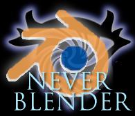
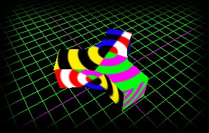
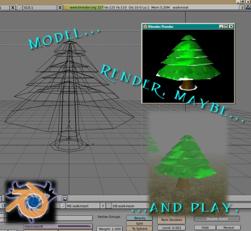

<figure class="featured-image">
  
</figure>

**NeverBlender** was a project I started and, luckily, it was
picked up by others. Things went a little bit south at my end.

NeverBlender is a Python script extension that allowed exporting
[Neverwinter Nights][wikipedia-nwn] format Bioware MDL files from
[Blender][blender] - the version I made seemingly worked up to
version 2.5x.
At the time, it supported exporting basic model geometry and texture UV maps.
It also allowed keeping MDL-specific settings in a text block in model file.

My original plan for fancy future directions would have been to
support animation exporting and some of the other features supported
by MDL file format.

<figure class="featured-image">
  
</figure>

At the time when the project started, the prefered 3D modeling program
for making MDL files was Discreet's Gmax (a cut-down freeware version
of 3DS Max). I had two reasons for starting this project. First, I
didn't know how to use 3DS Max and I was already familiar with
Blender; second, I thought the way Gmax supported animations was janky
and limited. You had only one timeline which you had to manually split
up among various animations, while Blender at the time already
supported animation actions. (Of course, ultimately, this was all
academic because I never actually got to implement animation
exporting!)

Git-ified version of the
[original NeverBlender repository][neverblender-codeberg] is available
in Codeberg.

<figure class="featured-image">
  
</figure>

It was originally developed between 2003–2006.
At this page, I'll probably later on go on to describe the various
misadventures with the development process and why I wasn't quite able
to continue the project.

But suffice to say, I'm happy that the torch was picked up! The
development was subsequently continued by "Symmetric":

* [NeverBlender for Blender 2.69][for-blender-2.69]
* [NeverBlender for Blender 2.79][for-blender-2.79]
* [NWN Wiki page][nwnwiki]

I've not kept at touch with the current developers and I don't know if
there's a public code repository for these.

I'm not at the moment involved with these subsequent projects, and at
this point, they've evolved way, way, *way* past what I could
ever do.

[wikipedia-nwn]: https://en.wikipedia.org/wiki/Neverwinter_Nights_(2002_video_game)
[blender]: https://www.blender.org/
[neverblender-codeberg]: https://codeberg.org/umbraroze/NeverBlender
[for-blender-2.69]: https://neverwintervault.org/project/nwn1/other/tool/neverblender-v1
[for-blender-2.79]: https://neverwintervault.org/project/nwn1/other/tool/neverblender-27
[nwnwiki]: https://nwn.wiki/spaces/NWN1/pages/38176439/NeverBlender
